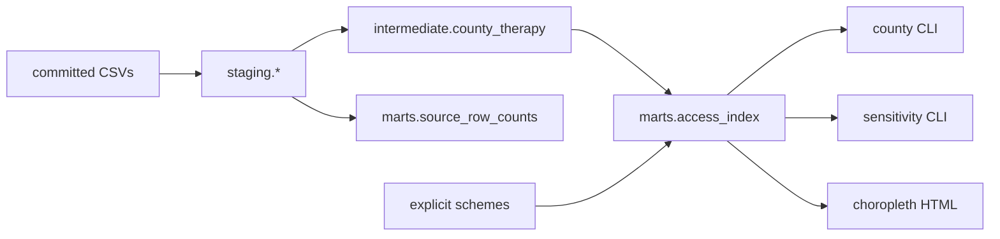

# access-gap

Map who can actually reach approved gene therapies. The analytical unit
is county × therapy. A dbt-style DuckDB warehouse stages a committed
3-state slice. The access index is fully transparent. Not a care
navigator.

[](https://github.com/techiegoku2623/access-gap/actions/workflows/ci.yml)
[](pyproject.toml)
[](LICENSE)

## Status

| Phase | Deliverable | Status |
| --- | --- | --- |
| 0 | Research memo and harnesses | Merged — docs/phase-0/research-memo.md |
| 1 | Architecture, schemas, data contracts | Merged — docs/ARCHITECTURE.md |
| 2 | First vertical slice | Merged |
| 3 | Evaluation and demo | Merged — demo/*.cast |

Status values: Not started / In progress / In review / Merged.

## The problem this solves

A therapy can be FDA-approved and Medicaid-listed and still be
unreachable from a given county. Distance, coverage, insurance
completeness, and the width of the published prevalence range do not
move together. A single undocumented composite hides the county that is
14 miles from a center the state will not pay for, and the county whose
eligible population is a 10× interval.

This repo measures those disagreements before it publishes an index. It
is research tooling. It is not a care navigator, not a coverage
determination, and not medical advice. Numbers are designed stand-ins.
Missing ACS is never imputed to zero. Prevalence is an interval.

## Walkthrough

No credentials. `PATH=$HOME/.local/bin:$PATH`.

```bash
make setup && make demo
```

`make demo` runs `access-gap demo`: warehouse build, three designed
counties side by side, sensitivity, choropleth. Actual stdout:

### Step 1 — dbt-style build and lineage

```bash
make demo-build
```

```
access-gap demo-build
DuckDB dbt-style: staging → intermediate → marts

Lineage
staging.counties ──────────────┐
staging.therapies ─────────────┤
staging.distances ─────────────┤
staging.medicaid_coverage ─────┼── intermediate.county_therapy
staging.acs_insurance ─────────┤         │
staging.prevalence ────────────┘         │
                                         ▼
                                   marts.access_index
staging.* ──────────────────────────► marts.source_row_counts
weights.py (explicit schemes) ──────► score; never a hidden composite

relation                       n
staging.counties              12
staging.therapies              3
staging.county_therapy        36
intermediate.county_therapy   36
marts.access_index            36
marts.source_row_counts        8

test                           result  detail
unique_county_therapy          PASS    rows=36 distinct=36
not_null_keys                  PASS    null keys=0
acs_never_imputed_to_zero      PASS    Gilmer (54021) insured_pct is NULL, not 0
gilmer_blank_in_staging        PASS    blank ACS rows for Gilmer=1
index_row_count                PASS    index rows=36
index_fk_county_therapy        PASS    orphans=0
no_silent_prevalence_midpoint  PASS    marts has no midpoint column
All warehouse tests passed. ACS blanks stay blank; never imputed to zero.
```

Recording: `demo/01-dbt-build-lineage.cast`.

### Step 2 — county decomposition (best-case, rural, no-coverage)

```bash
access-gap county --fips 06075 --therapy zolgensma
access-gap county --fips 48105 --therapy zolgensma
access-gap county --fips 48201 --therapy casgevy
```

Actual stdout (side by side in `access-gap county --compare` / `make demo`):

```
06075  San Francisco County, CA  × zolgensma  (best_case)
  rural:            False
  distance:         8.0 mi one-way → 128.0 effective mi (×2 × 8 visits)  nearest=ucsf
  medicaid:         covered
  ACS insured_pct:  0.94
  prevalence/100k:  [8.0, 10.0]  ratio=1.250
  eligible pop:     [64.64, 80.80]  INTERVAL  ratio=1.250  (no midpoint stored)
  index (default): 0.801  incomplete=False  missing=[]
  travel    weight=0.400  score=0.540  contribution=0.216
  medicaid  weight=0.350  score=1.000  contribution=0.350
  insurance weight=0.250  score=0.940  contribution=0.235
  capacity  unused (source unusable on this slice)
  imputed_acs_to_zero: false   silent_point_estimate: false

48105  Crockett County, TX  × zolgensma  (distance_dominated)
  rural:            True
  distance:         360.0 mi one-way → 5760.0 effective mi (×2 × 8 visits)  nearest=tch
  medicaid:         covered
  ACS insured_pct:  0.78
  eligible pop:     [0.25, 0.31]  INTERVAL
  index (default): 0.555
  travel contribution=0.010  medicaid=0.350  insurance=0.195

48201  Harris County, TX  × casgevy  (coverage_gap)
  rural:            False
  distance:         14.0 mi one-way → 336.0 effective mi (×2 × 12 visits)  nearest=tch
  medicaid:         NOT covered
  eligible pop:     [1200.00, 1920.00]  INTERVAL
  index (default): 0.328
  travel contribution=0.123  medicaid=0.000  insurance=0.205
```

Recording: `demo/02-county-decomposition.cast`.

### Step 3 — sensitivity and map

```bash
access-gap sensitivity --therapy zolgensma
make report
```

Actual stdout (therapy-level Spearman; 12 Zolgensma counties):

```
access-gap sensitivity  therapy=zolgensma
counties=12  complete-case n=12  min Spearman=0.235
scheme A         scheme B              n      ρ
default          geography_only       12  0.799
default          coverage_only        12  0.312
geography_only   coverage_only        12  0.274
coverage_only    travel_heavy         12  0.235
Counties that move most: Gilmer 54021 (shift 11), Harris 48201 (shift 7)
Index needs rethinking: min Spearman < 0.70. Weights stay explicit.
Wrote choropleth to docs/report.html
```

Recording: `demo/03-sensitivity-and-map.cast`. Map: `docs/report.html`.

## Layout

Read in this order:

1. `docs/phase-0/research-memo.md` — why the defaults and the failure condition
2. `docs/ARCHITECTURE.md` — warehouse contracts and transparent weights
3. `data/sample/README.md` — why each demo county × therapy exists
4. `docs/DATA.md` — committed stand-ins; every number has a retrieval date
5. `src/access_gap/weights.py` — explicit, configurable weights
6. `src/access_gap/county_view.py` — interval eligible pop + contributions
7. `research/phase0/` — the three measurements behind the memo

## Results

Regenerated by `make eval`. Baseline column is mandatory.

<!-- EVAL_TABLE_BEGIN -->

| Measurement | Value | n | Notes |
| --- | --- | --- | --- |
| Unusable sources | capacity_sparse | 12 counties | Completeness < 0.80 or stale |
| Min Spearman across weights | 0.632 | 33 | Index needs rethinking |
| Wide prevalence pairs | 1 | 36 | McDowell × Luxturna ratio 10.0× |
| Silent point estimate used | no | — | Intervals only |
| ACS imputed to zero | no | — | Gilmer stays missing |
| National extract | unmeasured | — | 3-state slice only |

<!-- EVAL_TABLE_END -->

## 🏗️ Architecture & Event Topology



County × therapy is the grain. Travel burden is multi-visit.
Prevalence is an `Interval`. Missing ACS stays missing.

## ⚖️ Architecture Trade-offs & Pragmatic Decisions

| Chosen | Given up | What would change the answer |
| --- | --- | --- |
| Explicit weight schemes + Spearman test | One unpublished composite | National ρ ≥ 0.70 across the same schemes |
| Multi-visit miles | Straight-line only | OSRM driving time changing ranks after the multiplier |
| Prevalence as an interval | A midpoint eligible-pop | A disease whose published range is < 2× |
| Committed 3-state slice | Live CMS/Census | Dated national extract + manifest |
| DuckDB staging | Hosted dbt Cloud | A file that no longer fits in memory |

## 🛡️ Edge Cases & Failure Modes

- Harris × Casgevy: 14 miles, Medicaid false. Geography ≠ coverage.
- Crockett × Zolgensma: 360 miles × 2 × 8 visits. Distance dominates.
- McDowell × Luxturna: prevalence 0.1–1.0 per 100k (10×). Interval only.
- Gilmer ACS blank: never a zero. Partial weights, `incomplete=true`.
- Capacity present for two of three centers: source marked unusable.
- "Covered" is not prior-auth approved and not a slot on Tuesday.

## Limitations

This is not a care navigator. The slice is 12 counties, not a national
file. Driving time, live CMS freshness, and utilization correlation are
unmeasured. The index is a transparent weighted sum, not a claim about
who should be treated.

## License and citation

MIT. Cite the retrieval-dated sources in `data/sample/manifests/sources.json`
and this repository for the warehouse. Do not cite the stand-in miles or
coverage bits as official statistics.
