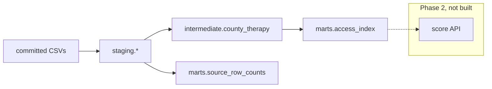

# access-gap

Map who can actually reach approved gene therapies. The analytical unit
is county × therapy. A dbt-style DuckDB warehouse stages a committed
3-state slice. Not a care navigator.

[](https://github.com/techiegoku2623/access-gap/actions/workflows/ci.yml)
[](pyproject.toml)
[](LICENSE)

## Status

| Phase | Deliverable | Status |
| --- | --- | --- |
| 0 | Research memo and harnesses | In review — docs/phase-0/research-memo.md |
| 1 | Architecture, schemas, data contracts | Not started |
| 2 | First vertical slice | Not started |
| 3 | Evaluation and demo | Not started |

Status values: Not started / In progress / In review / Merged.

## The problem this solves

A therapy can be FDA-approved and Medicaid-listed and still be
unreachable from a given county. Distance, coverage, insurance
completeness, and the width of the published prevalence range do not
move together. A single undocumented composite hides the county that is
14 miles from a center the state will not pay for, and the county whose
eligible population is a 10× interval.

This repo measures those disagreements before it publishes an index. It
is research tooling. It is not a care navigator, not a coverage
determination, and not medical advice. Phase 0 numbers are designed
stand-ins.

## Walkthrough

Phase 0 ships the designed 3-state slice and the measurement harnesses.
The `access-gap score` command is reserved for Phase 2; running it now
is not implemented on purpose.

### Step 1 — designed county × therapy cases

```bash
make setup && make demo
```

`make demo` calls `access-gap demo-plan --dry-run`. Actual stdout:

```
access-gap designed county × therapy cases

best_case  06075 San Francisco County, CA  × zolgensma
  path:     adjacent certified center plus broad Medicaid
  expected: Ranks at or near the top under every weight scheme

distance_dominated  48105 Crockett County, TX  × zolgensma
  path:     300+ mile rural travel burden
  expected: Geography-only rank is last among Zolgensma rows; coverage-only is mid

coverage_gap  48201 Harris County, TX  × casgevy
  path:     close to a center but Medicaid does not cover
  expected: Geography-only rank is high; coverage-only rank is last among Casgevy rows

wide_prevalence  54047 McDowell County, WV  × luxturna
  path:     published prevalence range is 10x
  expected: prevalence ratio is 10; never collapse to a midpoint

missing_acs  54021 Gilmer County, WV  × zolgensma
  path:     ACS insured_pct is blank
  expected: insured_pct stays missing; index does not impute zero

Research tool only. Designed stand-in numbers, not a live CMS or Census
pull. This is not a care navigator and not a coverage determination.
```

The records are designed: best-case adjacency, distance dominance,
coverage-versus-geography, a 10× prevalence range, and missing ACS.
See `data/sample/README.md`.

Recordings `demo/01-score.cast` land in Phase 3.

### Step 2 — warehouse completeness (Phase 0)

```bash
make research
```

DuckDB stages the CSVs (`staging` → `intermediate` → `marts`).
`source_coverage` decides which sources are usable.

### Step 3 — index weights and prevalence intervals

The same run writes Spearman correlations across explicit weight
schemes and propagates prevalence intervals. If rankings swing, the
memo says the index needs rethinking.

### Step 4 — reserved score, then the measured baseline

```bash
access-gap score --scheme default
make eval
```

`access-gap score` is reserved (Phase 2). `make eval` already runs: it
regenerates `docs/EVALUATION.md` from the Phase 0 harnesses.

## Layout

Read in this order:

1. `docs/phase-0/research-memo.md` — why the defaults and the failure condition
2. `data/sample/README.md` — why each demo county × therapy exists
3. `docs/DATA.md` — committed stand-ins; every number has a retrieval date
4. `src/access_gap/weights.py` — explicit, configurable weights
5. `research/phase0/` — the three measurements behind the memo
6. `src/access_gap/cli.py` — demo-plan only, until Phase 2

## Results

Regenerated by `make eval`. Baseline column is mandatory.

<!-- EVAL_TABLE_BEGIN -->

| Measurement | Value | n | Notes |
| --- | --- | --- | --- |
| Unusable sources | capacity_sparse | 12 counties | Completeness < 0.80 or stale |
| Min Spearman across weights | 0.632 | 33 | Index needs rethinking |
| Wide prevalence pairs | 1 | 36 | McDowell × Luxturna ratio 10.0× |
| Silent point estimate used | no | — | Intervals only |
| National extract | Phase 2 | — | Live CMS/Census unmeasured |

<!-- EVAL_TABLE_END -->

## 🏗️ Architecture & Event Topology



County × therapy is the grain. Travel burden is multi-visit.
Prevalence is an `Interval`. Missing ACS stays missing.

## ⚖️ Architecture Trade-offs & Pragmatic Decisions

| Chosen | Given up | What would change the answer |
| --- | --- | --- |
| Explicit weight schemes + Spearman test | One unpublished composite | National ρ ≥ 0.70 across the same schemes |
| Multi-visit miles | Straight-line only | OSRM driving time changing ranks after the multiplier |
| Prevalence as an interval | A midpoint eligible-pop | A disease whose published range is < 2× |
| Committed 3-state slice | Live CMS/Census in Phase 0 | Dated national extract + manifest |
| DuckDB staging | Hosted dbt Cloud | A file that no longer fits in memory |

## 🛡️ Edge Cases & Failure Modes

- Harris × Casgevy: 14 miles, Medicaid false. Geography ≠ coverage.
- Crockett × Zolgensma: 360 miles × 2 × 8 visits. Distance dominates.
- McDowell × Luxturna: prevalence 0.1–1.0 per 100k (10×). Interval only.
- Gilmer ACS blank: never a zero. Partial weights, `incomplete=true`.
- Capacity present for two of three centers: source marked unusable.
- "Covered" is not prior-auth approved and not a slot on Tuesday.

## Limitations

This is not a care navigator. Phase 0 scores designed stand-in rows, not
a national file. Driving time, live CMS freshness, and utilization
correlation are unmeasured. No demo recording is committed.

## License and citation

MIT. Cite the retrieval-dated sources in `data/sample/manifests/sources.json`
and this repository for the warehouse. Do not cite the stand-in miles or
coverage bits as official statistics.
