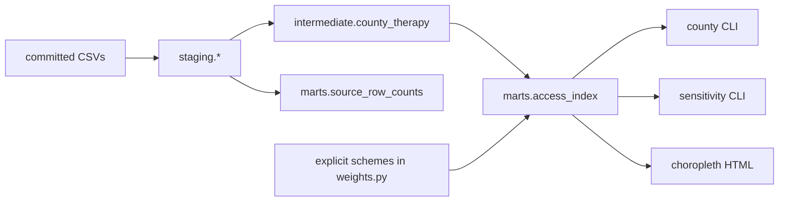

# Architecture — access-gap (Phase 1)

Not a care navigator. The unit is county × therapy. The index is fully
transparent: every weight, every missing component, and every eligible
population is an interval.

## Data contracts

| Object | Grain | Rule |
| --- | --- | --- |
| `CountyTherapy` | county × product | 36 rows on the committed 3-state slice |
| `Interval` | prevalence / eligible pop | no stored midpoint |
| `WeightScheme` | named vector | renormalized after dropping missing inputs |
| `AccessScore` | county × product × scheme | `incomplete=true` when ACS is blank |
| DuckDB schemas | staging → intermediate → marts | dbt-style, local, no service |

Missing ACS is never imputed to zero. Gilmer County (`54021`) is the
failing test if a zero appears.

## Lineage

Travel burden is `one_way_miles * 2 * visit_multiplier`.

## CLI surface

| Command | Phase |
| --- | --- |
| `demo-build` | 1 — lineage + warehouse tests |
| `county --fips --therapy` | 2 — distance, coverage, interval, contributions |
| `sensitivity --therapy` | 2 — Spearman + movers |
| `report` / `make report` | 3 — schematic choropleth |

## What is not here

No live CMS or Census pull. No driving-time matrix. No patient-level
score. Capacity is in the schema and marked unusable on this slice.
